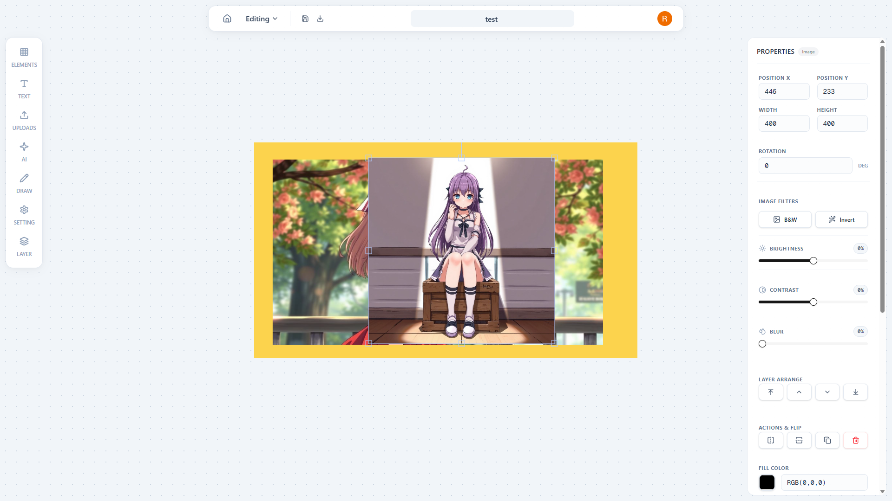

<div align="center">


### The open-source graphic design platform. Create stunning visuals with AI.

[](https://nextjs.org)
[](https://nodejs.org)
[](https://mongodb.com)
[](http://fabricjs.com)

</div>

---

## ✨ What is Imaginex?

**Imaginex** is a full-stack, browser-based graphic design tool — think Canva, but open-source and AI-powered. Design YouTube thumbnails, social media posts, and more, then generate images using **Flux AI** directly inside the editor.



---

## 🚀 Features

### 🎨 Powerful Design Editor
- Drag-and-drop canvas powered by **Fabric.js**
- Add and style **text, shapes, images** with a rich properties panel
- Export designs as **PNG or JPEG**
- Auto-save on every change

### 🤖 AI Image Generation
Describe what you want and Imaginex generates it in seconds using **Flux AI** (via Replicate). Choose your aspect ratio and drop the result straight onto your canvas.


### 📁 Media Library
- Upload your own images (stored on **Cloudinary**)
- Manage and reuse your uploads across designs

### 🔐 Google Authentication
- Sign in with Google via **NextAuth.js**
- All designs and media are private to your account

### 📱 Responsive
- Works on mobile with a touch-friendly bottom toolbar
- Canvas scales to fit any screen size

---

## 🏗️ Architecture

Imaginex is built as a **microservices** application:

```
┌─────────────────┐        ┌──────────────────────┐
│   Next.js App   │──────▶ │    API Gateway :5000  │
│   (Client)      │        └──────────┬───────────┘
└─────────────────┘                   │
                           ┌──────────┼───────────┐
                           ▼          ▼            ▼
                    ┌──────────┐ ┌─────────┐ ┌─────────────┐
                    │ Design   │ │ Upload  │ │ Subscription│
                    │ Service  │ │ Service │ │ Service     │
                    │ :5001    │ │ :5002   │ │ :5003       │
                    └──────────┘ └─────────┘ └─────────────┘
                           │          │
                    ┌──────▼──────────▼──────┐
                    │      MongoDB Atlas      │
                    └────────────────────────┘
```

---

## 🖥️ Running Locally

### Prerequisites
- **Node.js** v18+
- **MongoDB Atlas** account (free tier works)
- **Google Cloud** OAuth credentials
- **Cloudinary** account (free tier)
- **Replicate** API token

### 1. Clone the repository

```bash
git clone https://github.com/rajaryan2007/Imaginex.git
cd Imaginex
```

### 2. Configure Environment Variables

#### `client/.env`
```env
AUTH_SECRET=your_random_secret_string
AUTH_GOOGLE_ID=your_google_client_id
AUTH_GOOGLE_SECRET=your_google_client_secret
AUTH_ID_SECRET=your_auth_id_secret
NEXTAUTH_SECRET=your_nextauth_secret
NEXTAUTH_URL=http://localhost:3000

# Optional: only needed for production
# NEXT_PUBLIC_API_URL=https://your-api-gateway.vercel.app
```

#### `server/api-gateway/.env`
```env
PORT=5000
DESIGN=http://localhost:5001
UPLOAD=http://localhost:5002
SUBSCRIPTION=http://localhost:5003
GOOGLE_CLIENT_ID=your_google_client_id

# Optional: explicit CORS override
# CLIENT_URL=http://localhost:3000
```

#### `server/design-service/.env`
```env
PORT=5001
MONGO_URI=mongodb+srv://<user>:<password>@cluster.mongodb.net/?appName=Cluster0
```

#### `server/upload-service/.env`
```env
PORT=5002
MONGO_URI=mongodb+srv://<user>:<password>@cluster.mongodb.net/?appName=Cluster0
CLOUDINARY_CLOUD_NAME=your_cloud_name
CLOUDINARY_API_KEY=your_api_key
CLOUDINARY_API_SECRET=your_api_secret
REPLICATE_API_TOKEN=your_replicate_token
Image_API=your_image_api_key
```

#### `server/subscription-service/.env`
```env
PORT=5003
MONGO_URI=mongodb+srv://<user>:<password>@cluster.mongodb.net/?appName=Cluster0
```

### 3. Install & Start Services

Open **5 separate terminals**:

```bash
# Terminal 1 — Design Service
cd server/design-service
npm install
npm run dev

# Terminal 2 — Upload Service
cd server/upload-service
npm install
npm run dev

# Terminal 3 — Subscription Service
cd server/subscription-service
npm install
npm run dev

# Terminal 4 — API Gateway
cd server/api-gateway
npm install
npm run dev

# Terminal 5 — Frontend
cd client
npm install
npm run dev
```

Open [http://localhost:3000](http://localhost:3000) in your browser.

> **Tip:** You can also use `docker-compose up` from the root to start all backend services at once (requires Docker).

---

## ☁️ Deploying to Vercel

Each service (frontend + 4 backend microservices) is deployed as a **separate Vercel project**.

### Step 1 — Deploy the Backend Services

Deploy each of these folders as its own Vercel project:

| Service | Folder | 
|---|---|
| API Gateway | `server/api-gateway` |
| Design Service | `server/design-service` |
| Upload Service | `server/upload-service` |
| Subscription Service | `server/subscription-service` |

For each backend project in the Vercel dashboard (**Settings → Environment Variables**), add the variables from the corresponding `.env` section above.

### Step 2 — Deploy the Frontend

Deploy the `client/` folder as a Vercel project. Add these environment variables:

| Variable | Value |
|---|---|
| `NEXTAUTH_URL` | `https://your-frontend.vercel.app` |
| `NEXT_PUBLIC_API_URL` | `https://your-api-gateway.vercel.app` |
| `AUTH_GOOGLE_ID` | Your Google Client ID |
| `AUTH_GOOGLE_SECRET` | Your Google Client Secret |
| `AUTH_SECRET` | A random secret string |
| `NEXTAUTH_SECRET` | A random secret string |

### Step 3 — Wire Up the API Gateway

In your **API Gateway** Vercel project, set the microservice URLs:

| Variable | Value |
|---|---|
| `DESIGN` | `https://your-design-service.vercel.app` |
| `UPLOAD` | `https://your-upload-service.vercel.app` |
| `SUBSCRIPTION` | `https://your-subscription-service.vercel.app` |
| `GOOGLE_CLIENT_ID` | Your Google Client ID |

### Step 4 — Update Google OAuth

In the [Google Cloud Console](https://console.cloud.google.com/), add your Vercel URLs to the **Authorized redirect URIs**:
```
https://your-frontend.vercel.app/api/auth/callback/google
```

---

## 🛠️ Tech Stack

| Layer | Technology |
|---|---|
| Frontend | Next.js 15, Tailwind CSS, Fabric.js |
| Auth | NextAuth.js (Google OAuth) |
| API Gateway | Express.js + express-http-proxy |
| Design Service | Express.js, Mongoose |
| Upload Service | Express.js, Mongoose, Cloudinary, Multer |
| AI Generation | Replicate (Flux model) |
| Database | MongoDB Atlas |
| Deployment | Vercel |

---

## 📄 License

MIT © [Raj Aryan](https://github.com/rajaryan2007)
